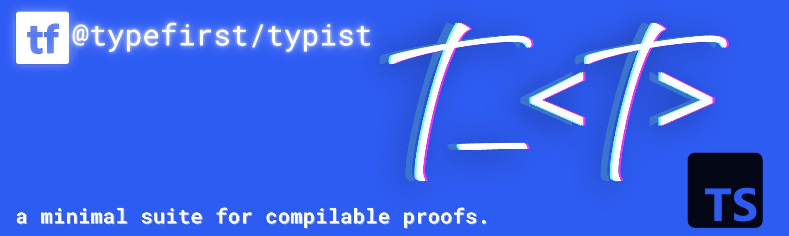

<div align="center">



# 🔍 Typist

### Primitive Type-First Utilities for TypeScript

*Show what your types are made of*

[](https://badge.fury.io/js/%40typefirst%2Ftypist)
[](https://www.typescriptlang.org/)
[](https://choosealicense.com/licenses/mit/)
[](https://nodejs.org/)
[](https://bundlephobia.com/package/@typefirst/typist)
[](https://github.com/type-first/typist/issues)
[](https://github.com/type-first/typist)

---

**A minimal, compositional, and debug-friendly suite of type-level utilities for TypeScript**

[Getting Started](#-installation) • [API Reference](#-api-reference) • [Examples](#examples) • [Contributing](https://github.com/type-first/typist/blob/main/CONTRIBUTING.md)

</div>

## ✨ Features

Typist is a collection of small, focused utilities for type-level debugging and static validation in TypeScript.

| Feature | Description |
|---------|-------------|
| 🔍 **Type Assertions** | Compiler-enforced static assertions for compilable proofs |
| 🧱 **Type Materialization** | Utilities for resolving complex inferred types |
| 🎭 **Phantom Types** | Runtime-agnostic operators for flexible type transportation and inference logic |
| ⚖️ **Verdict Encoding** | Rich error reporting techniques for recursive and conditional type inspection with customizable diagnostic metadata |
| 🧩 **Symbolic Inference** | Type manipulation as first-class operations |
| 🫙 **Scope Blocks** | Block-based grouping for type-level test suites |
| 🚀 **Zero Runtime** | Pure compile-time operations |
| 📦 **ESM Ready** | Modern module system support |

## 🎯 Why Typist?

Typist exists to support a **type‑first approach** to software development: leveraging the compiler as an active analytical tool, enforcing architectural constraints, validating domain models, and enabling precise, inference‑driven workflows. This can significantly **strengthen code generation capability**.

### 💡 Zero Cost Abstraction

- **No dependencies** – Completely standalone
- **Virtually zero runtime overhead** – Pure compile-time operations
- **Tiny bundle** – Less than 1KB gzipped and minified
- **TypeScript native** – Built for TypeScript 4.9+

## 📦 Installation

```bash
# npm
npm install @typefirst/typist

# yarn  
yarn add @typefirst/typist

# pnpm
pnpm add @typefirst/typist
```

## 🚀 Quick Start

```typescript
import { is_, has_, phantom_, example_ } from '@typefirst/typist'

// Type assertions at compile-time
const user = { name: 'Alice', age: 30 }
is_<{ name: string; age: number }>(user) // ✅ Passes
has_<'name', string>(user)              // ✅ Passes

// Phantom types for type transportation
type User = { id: string; email: string }
const userPhantom = phantom_<User>()
is_<User>(userPhantom)                  // ✅ Passes

// Scoped type testing
const result = example_('user validation', () => {
  const validUser = { id: 'u123', email: 'alice@example.com' }
  is_<User>(validUser)
  return validUser
})
```

## 📚 API Reference

### 🔒 Assertions

Assertions are compile-time guarantees. Each is a function that returns `void` and causes a TypeScript error if its condition is false.

<details>
<summary><code>is_&lt;Type&gt;(thing)</code> – Type assignability assertion</summary>

Asserts that `thing` is assignable to `Type`.

**Alias:** `assignable_`

```typescript
const timestamp = Date.now()

is_<number>(timestamp)     // ✅ Passes

// @ts-expect-error
is_<string>(timestamp)     // ❌ Fails at compile time
```

</details>

<details>
<summary><code>has_&lt;Key, Value?&gt;(thing)</code> – Property assertion</summary>

Asserts that `thing` has a property `Key`, optionally with value type `Value`.

```typescript
const person = { name: 'ponyboy', age: 15 }

has_<'age'>(person)           // ✅ Has property 'age'
has_<'name', string>(person)  // ✅ Has property 'name' of type string

// @ts-expect-error
has_<"email">(person)         // ❌ No 'email' property
```

</details>

<details>
<summary><code>extends_&lt;A, B&gt;()</code> – Type relationship assertion</summary>

Asserts that `A extends B`.

```typescript
type User = { email: string, admin: boolean }
type AdminUser = User & { admin: true }

extends_<AdminUser, User>()   // ✅ AdminUser extends User

const user = { 
  email: 'ponyboycurtis67@hotmail.com', 
  admin: false 
} as const

extends_<typeof user, User>() // ✅ Passes

// @ts-expect-error
extends_<typeof user, AdminUser>() // ❌ admin is false, not true
```

</details>

<details>
<summary><code>instance_&lt;Ctor&gt;(value)</code> – Instance assertion</summary>

Asserts that `value` is an instance of constructor type `Ctor`.

```typescript
class Dog {}
class Cat {}

const dog = new Dog()

instance_<Dog>(dog)    // ✅ Passes

// @ts-expect-error
instance_<Cat>(dog)    // ❌ dog is not a Cat instance
```

</details>

<details>
<summary><code>never_&lt;T&gt;()</code> – Never type assertion</summary>

Asserts that a type resolves to `never`.

```typescript
type Impossible = Extract<'a', 'b'>

never_<Impossible>()

// @ts-expect-error
never_<string>()
```

### Verdict Assertions

These consume `$Verdict` result types (`$Yes` or `$No`).

Generic verdict types allow us to write maximally complex evaluative logic beyond what is possible using only standalone assertion functions, such as conditional recursion. We can test for conditions like strict equality (bidirectional assignability).

* `yes_` — requires `$Yes`
* `no_` — requires `$No`
* `assert_` — requires `$Yes` **or** `true`

```ts
yes_<$Equal<'✌️', '✌️'>>

no_<$Equal<'✌️', string>>

yes_<$Extends<'✌️', string>>

// @ts-expect-error
yes_<$Extends<string, ✌️>>
```

### Verdicts

Verdicts represent explicit yes/no results with diagnostic metadata. You can perform maximally complex type evaluations using recursive conditional logic by writing generic verdict types that resolve to `$Yes` or `$No`.

#### `$Yes`

Indicates success.

#### `$No<Message, Dump>`

Captures metadata at failure path. This is the type-level version of throwing a runtime error with `{ message, data }`.

* `message: string`
* `dump: readonly any[]`

### Verdict Utilities

Commonly useful verdict utility types that ship out-of-the-box: `$Equal<A, B>`, `$Extends<A, B>`

### Phantom Values

A phantom value is a nominal runtime value used solely to **transport type information**. 

#### `phantom_<T>(value?)`

Creates a value with type `T`.
The argument `value` is optional, ignored by the compiler, but retained at runtime if you supply it.

Alias: `p_`, `type_`, `t_`, `force_`

```ts
type Person = { name:string; age:number }

const person_ = phantom_<Person>()

is_<Person>(person_)

// @ts-expect-error
is_<string>(person_)
```

### Operators

Operators return phantom values. They manipulate or capture type identity.

#### `assign_<T>(value)`

Returns the provided value as type `T`, enforcing that the original value type is assignable to `T`. Used to safely widen types to be less specific while preserving runtime value.

Alias: `as_`, `widen_`

```ts
const narrow = 'hello'

is_<'hello'>(narrow)

const wide = assign_<string>(literal)

is_<string>(wide)

// @ts-expect-error
is_<'hello'>(wide)
```

#### `nope_(value?)`

Produces a phantom typed as `never`, preserving runtime value.

```ts
const neverFoo = nope_('foo')
```

#### `any_(value?)`

Produces a phantom typed as `any`, preserving runtime value.

Alias: `__`

```ts
const anyBar = any_('bar')
```

#### `resolve_<T>(value?)`

Returns an expanded representation of `T`, resolving its property names. This expansion is *semantically equivalent* to the original (mutually assignable), but easier to inspect.

Aliases: `r_`

`_r<T>` is the type version of `resolve_`, which we can use with type definitions.

```ts
type Expanded = _r<Original>
```

#### `flush_<T>(value?)`

Recursive version of `resolve_`. Expands nested structures while remaining equivalent to the original type.

Aliases: `f_`

`_r<T>` is the type version of `resolve_`, which we can use with type definitions.

```ts
type Deep = _f<ComplexType>;
```


### Blocks

Blocks provide scope to prevent pollution. The type and runtime value returned by `fn` is passed through. This is the type version of a `describe()` block in a runtime assertion library.

#### `example_(label?, fn)`

Runs `fn`, allows assertions inside it, and returns the type of the final expression.

Aliases: `test_`, `proof_`.

```ts
const exampleUser
  = example_('user', () => 
    { const user = createUser('bob')
      is_<User>(user)
      has_<'id'>(user)
      return user } )
```